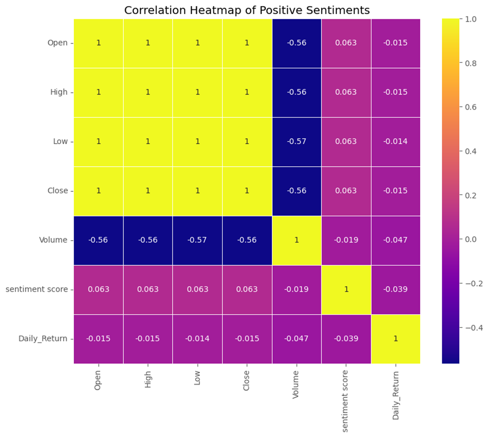

Introduction
From the financial news dataset the data filtering was done in reference to financial stock dataset. From here in the news data a stock variable with these ['AAPL', 'AMZN', 'GOOGL','GOOG', 'META','MSFT','NVDA','TSLA'] values were selected for simplicity and effectiveness of analysis. Then, the financial news dataset done in task one and stock dataset analyzed in task two were merged for further analysis of the correlation between sentiment score of opinions given and the stock price. The data merging process were takes place by alignment with dates of both dataframes. 
The dataset consists of 25,732 entries with 24 columns, capturing an extensive range of financial and stock market data. This dataset is a rich source of information for conducting comprehensive stock market analysis. It integrates traditional price and volume data with advanced technical indicators like SMA, RSI, and MACD, alongside daily returns and volatility measures. Additionally, the inclusion of headlines and URLs offers the ability to analyze the impact of news on stock performance. The dataset's diverse range of features makes it ideal for both quantitative analysis and the exploration of how external factors like news can influence stock prices.
Analysis Result
Correlation 
The financial sentiment score shows a weak positive correlation with the Close, Open, High, and Low stock prices. The highest correlation is observed with the Close prices (0.0094), while volume has weakly negative correlations with sentiment scores. 

Fig correlation matrix for General sentiment category of dataframe.

In a dataframe of negative sentiments, the financial sentiment score shows a weak negative correlation with the Close, Open, High, and Low stock prices., while volume has weakly positive correlations with sentiment scores. 

Fig correlation matrix for Negative Sentiments and stock price 
In a dataframe of positive sentiments, the financial sentiment score shows a weak positive correlation with the Close, Open, High, and Low stock prices., while volume has weakly negative correlations with sentiment scores. 

Fig correlation matrix for Positive Sentiments and stock price 

In a dataframe of neutral sentiments, the financial sentiment score shows a weak positive correlation with the Close, Open, High, Low and volume stock prices. 

Fig correlation matrix for Neutral Sentiments and stock price  

Generally, the correlations between the financial sentiment score and various stock metrics are generally weak, suggesting that financial sentiment, as captured in this dataset, does not have a strong linear relationship with stock prices or volume. While there is some positive association, it is minimal and likely not sufficient on its own to predict stock movements. This suggests that other factors may play more significant roles in determining stock price behavior, or that sentiment impacts stock prices in a more complex, non-linear manner.