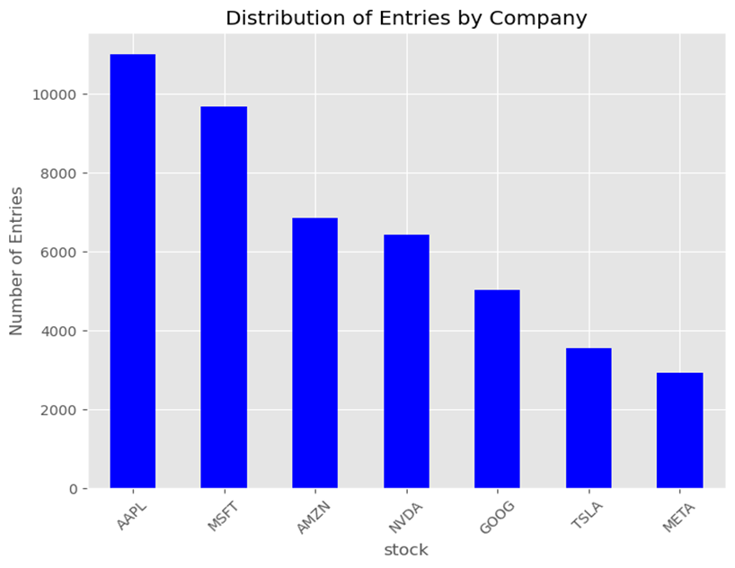
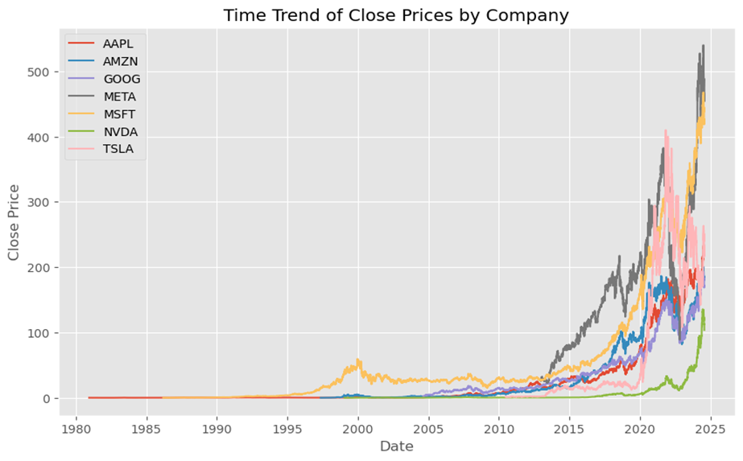
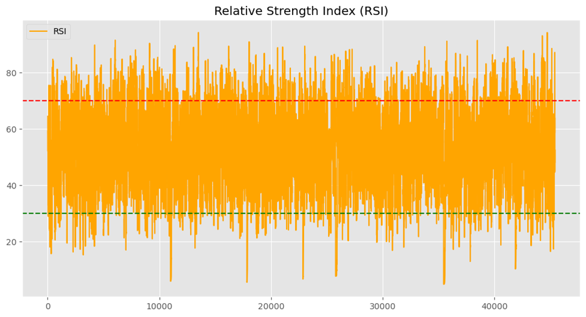
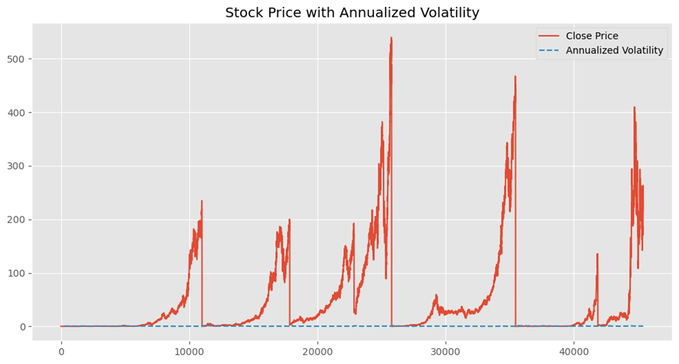
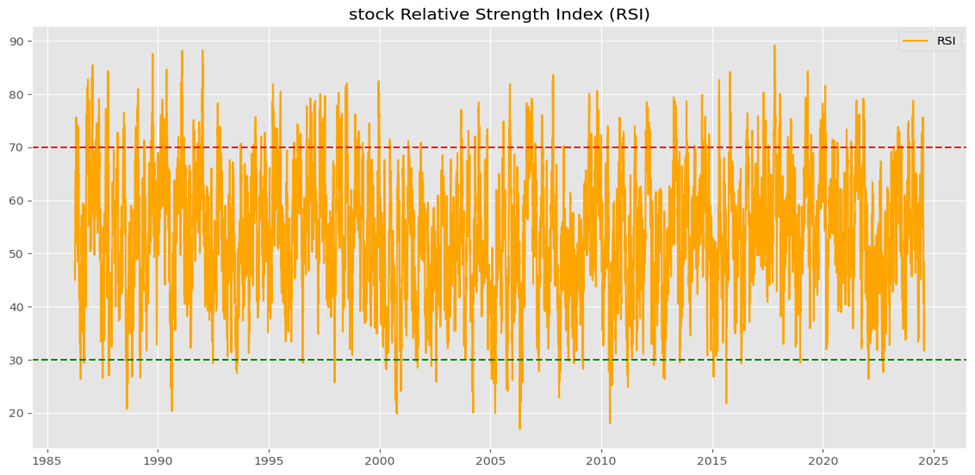

Introduction 
The seven datasets of each company were merged and form a dataset of analysis comprises 45,428 entries, capturing a wide range of financial data over an extensive period. Each row represents a daily record of stock market activity for a particular stock. The dataset contains a variable of Date, High, Low, Close,  Adj Close, volume, Stock Splits, Stock and Dividends

The dataset offers a comprehensive view of the daily trading activities of various stocks, making it an invaluable resource for performing detailed financial analyses, including trend analysis, volatility measurement, and performance assessment. The inclusion of dividends, stock splits, and adjusted close prices allows for more accurate financial historical analysis, accommodating corporate actions that affect stock prices.

Explanatory Data Analysis 

Fig 1: The number of entries in relation to companies

Fig 3: Close price for a stock from the 1980s to 2025

Results of Analysis 
Relative Strength Index (RSI) 
RSI (Relative Strength Index) is a momentum oscillator that measures the speed and change of price movements. RSI is primarily used to identify overbought or oversold conditions in a market. The RSI values fluctuate significantly over time, as evidenced by the dense orange line that oscillates between approximately 0 and 100 . The volatility of the RSI indicates frequent changes in the underlying asset’s price momentum.
 Red Dotted Line (Overbought Level) that positioned around the 70 level, this line represents the overbought threshold. When the RSI crosses above this level, it often signals that the asset may be overbought and could be due for a price correction or pullback.
Positioned around the 30 level, this line represents the oversold threshold. When the RSI drops below this level, it indicates that the asset may be oversold, which could suggest a potential buying opportunity as the price might rebound.

The RSI often peaks above the 70 level, hitting the red dotted line multiple times, indicating that the asset has frequently entered overbought territory. Similarly, there are frequent dips below the 30 level, touching the green dotted line, suggesting regular occurrences of oversold conditions. The RSI tends to revert to the middle range (40-60), showing a balanced momentum in between extremes.

The chart shows that the RSI frequently and rapidly moves across the spectrum, which is typical in a highly volatile market. This could indicate a market with frequent trend reversals or significant price swings. The high density of the orange line in the central region of the graph suggests that, despite the frequent spikes and drops, the RSI spends a substantial amount of time within a moderate range.
This RSI graph reflects a market characterized by frequent price swings and volatility. The regular movement between overbought and oversold conditions implies that traders might find numerous opportunities to buy low and sell high. However, the rapid changes also indicate that timing is crucial to capitalize on these opportunities.

Fig 1: Relative Strength Index (RSI) over time

Annualized volatility 
Close Price (Red Line represents the daily closing prices of the stock over the observed period. The closing price is the final price at which the stock is traded during a trading session.
Annualized Volatility (Dashed Blue Line) represents the stock's volatility on an annual basis, which is a statistical measure of the dispersion of returns. A higher volatility indicates a higher level of risk and uncertainty in the stock's price movement.
The stock’s price has undergone significant fluctuations, with notable peaks and troughs. There are multiple sharp spikes, followed by steep declines, indicating periods of rapid price increases and subsequent crashes. The price remains close to zero for extended periods, punctuated by these sudden increases. This could indicate a stock that experiences occasional bursts of high activity or speculation-driven price changes.
Despite the dramatic changes in the closing price, the annualized volatility remains relatively flat and low throughout the entire period. The discrepancy between the highly volatile price spikes and the low volatility measure suggests that these price movements might be short-lived and not sustained over long periods, hence the low annualized volatility.
 Another interpretation could be that the spikes are outliers in an otherwise stable market environment, which doesn’t significantly affect the long-term volatility measure.
The stock experiences periodic, intense price spikes, which may be driven by market speculation, news events, or low liquidity. The overall market doesn’t see these spikes as indicative of long-term risk, hence the stable low annualized volatility. For traders, these price spikes might represent short-term trading opportunities. However, for long-term investors, the low volatility suggests a relatively stable investment, assuming these spikes are not reflective of ongoing risk.
The graph portrays a stock with a largely stable risk profile (as suggested by the low volatility) but with occasional and significant price fluctuations. Understanding the reasons behind these spikes is crucial for making informed trading or investment decisions.

Fig 2:  Stock's closing price along with its annualized volatility over time

Relative Strength Index (RSI) for a stock over a long period, ranging from the mid-1980s to around 2025. The graph covers a substantial period, nearly four decades. This long-term view helps in understanding the RSI behavior across various market cycles. The RSI fluctuates between approximately 10 and 90 throughout the period. The orange line represents the RSI values, which oscillate around the mid-range but frequently touch or approach the overbought (70) and oversold (30) levels.
Red Dotted Line (Overbought Level at 70): The RSI crosses this threshold multiple times, indicating periods where the stock may be considered overbought, potentially signaling a price correction. Green Dotted Line (Oversold Level at 30): The RSI also crosses below this line occasionally, suggesting periods where the stock may be considered oversold, possibly indicating a buying opportunity.
From 1985-2000, the RSI shows frequent spikes above 70 and dips below 30, indicating high volatility and regular cycles of overbought and oversold conditions. From 2000-2025: The RSI continues to exhibit volatility, but there seems to be a higher frequency of movements within the 30-70 range, suggesting less extreme overbought or oversold conditions. The market may have become more stable or less prone to extreme movements during this period.
The RSI shows a clear cyclical pattern, with repeated swings between overbought and oversold territories. This cyclicality suggests that the stock goes through regular phases of strong momentum (either upward or downward), followed by corrections.

The RSI reflects the different market cycles over the decades, with periods of high volatility where the RSI frequently touches extreme levels, followed by more stable periods where the RSI remains within a moderate range.
Overbought/Oversold Signals: The frequent touching of the 70 and 30 levels indicates regular opportunities for traders to identify potential market reversals. Over such a long period, the RSI suggests that the stock has experienced several bull and bear markets, with investors frequently reacting to shifts in momentum.
This long-term RSI graph shows a stock with a history of significant price movements, characterized by frequent cycles of overbought and oversold conditions. These cycles provide traders with numerous opportunities to capitalize on momentum shifts, but also highlight the importance of timing and market awareness in long-term trading strategies. The general trend of the RSI remaining within the 30-70 range in later years could suggest a more mature market or a stock that has stabilized in its trading patterns.

Fig 3: Relative Strength Index (RSI) for a stock from the mid-1980s to 2025